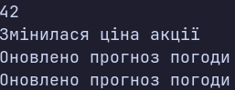

### Тема

Абстрактні класи та інтерфейси. Контракти та реалізації.

### Варіант

14. `IObserver<T> → ConsoleObserver<T> / FileObserver<T>`  
`EventPublisher → StockPricePublisher / WeatherUpdatePublisher`

**Інтерфейс: `IObserver<T>`**
* Метод: `void Update(T value)`
* `ConsoleObserver<T>` — виводить отримане значення в консоль.
* `FileObserver<T>` — записує отримане значення у файл `events.txt`.

**Абстрактний клас: `EventPublisher`**
* Абстрактні методи: `Subscribe(IObserver<string> observer)`, `Unsubscribe(IObserver<string> observer)`
* Конкретний метод: `NotifySubscribers(string message)`

**Похідні класи:**
* `StockPricePublisher` — не додає того самого спостерігача повторно.
* `WeatherUpdatePublisher` — дозволяє повторну підписку на події.

### Хід роботи

1. Створено консольний проєкт `lab10v14`.
2. Реалізовано інтерфейс `IObserver<T>` та класи `ConsoleObserver<T>` і `FileObserver<T>`.
3. Створено абстрактний клас `EventPublisher` з абстрактними методами підписки й відписки та конкретним методом сповіщення.
4. Створено похідні класи `StockPricePublisher` і `WeatherUpdatePublisher`.
5. У `Main` створено колекцію `List<IObserver<int>>` і викликано метод `Update` через тип інтерфейсу.
6. Створено колекцію `List<EventPublisher>` та викликано методи видавців через тип абстрактного класу.
7. На прикладі повторної підписки продемонстровано різну поведінку видавців: `StockPricePublisher` надсилає повідомлення один раз, а `WeatherUpdatePublisher` — двічі.
8. Файловий спостерігач записує отримані значення у `events.txt`.

### Результат

### Висновок

Реалізовано інтерфейс спостерігача та дві його реалізації, а також абстрактний клас видавця подій і два похідні класи. Продемонстровано поліморфні виклики через колекції типу інтерфейсу й абстрактного класу, а також різну поведінку видавців під час повторної підписки.

