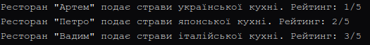

### Тема
Створення першого проєкту. Класи, об’єкти, конструктори та деструктори.
Середовище розробки.

Варіант
14. Клас Restaurant
- Поля: name, cuisine, rating
- Властивість: Name, Cuisine, Rating
- Метод: ServeDish()

### Хід роботи
1. Налаштовано Visual Studio Code та необхідні розширення.
2. Створено консольний проєкт lab1v14.
3. Реалізовано клас Restaurant з приватними полями, властивістю, конструктором та методом.
4. Створено 3 об’єкти класу та викликано ServeDish().
5. Налаштовано Git та додано .gitignore.
6. Проєкт завантажено на GitHub.

### Результат

