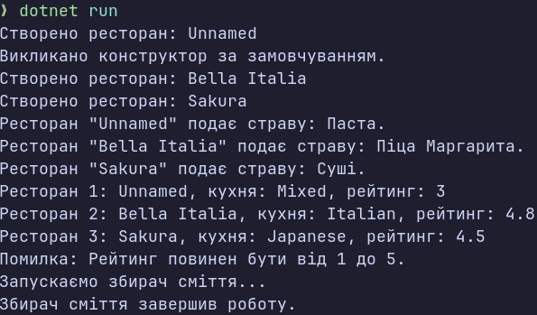

### Тема
Клас із кількома конструкторами. Життєвий цикл об’єкта.

### Варіант
14. Клас `Restaurant`
- Поля: `_name`, `_cuisine`, `_rating`
- Властивості: `Name`, `Cuisine`, `Rating`
- Конструктори: за замовчуванням та параметризований
- Ланцюговий виклик конструкторів через `: this()`
- Метод: `ServeDish()`
- Фіналізатор: `~Restaurant()`
- Валідація: рейтинг від 1 до 5

### Хід роботи
1. Створено консольний проєкт `lab2v14`.
2. Реалізовано клас `Restaurant` з приватними полями та публічними властивостями.
3. Реалізовано валідацію властивості `Rating`.
4. Створено два перевантажені конструктори з ланцюговим викликом через `: this()`.
5. Реалізовано метод `ServeDish()` та фіналізатор `~Restaurant()`.
6. Створено 3 об’єкти класу з використанням різних конструкторів.
7. Продемонстровано роботу методу `ServeDish()` та валідації рейтингу.
8. Використано `GC.Collect()` та `GC.WaitForPendingFinalizers()` для демонстрації роботи Garbage Collector.

### Результат

### Висновок
У ході лабораторної роботи реалізовано клас `Restaurant` з перевантаженими конструкторами, ланцюговим викликом через `: this()`, властивостями з валідацією, методом `ServeDish()` та фіналізатором. Досліджено життєвий цикл об’єкта та роботу Garbage Collector.
