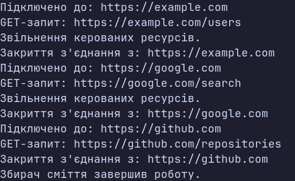

### Тема
Життєвий цикл об’єкта та керування ресурсами.

### Варіант
14. Клас `HttpClient`
- Поля: `_baseUrl`, `_isConnected`, `_disposed`
- Властивості: `BaseUrl`, `IsConnected`
- Метод: `Get(string endpoint)`
- Інтерфейс: `IDisposable`
- Методи: `Dispose()`, `Dispose(bool disposing)`
- Фіналізатор: `~HttpClient()`

### Хід роботи
1. Створено консольний проєкт `lab3v14`.
2. Реалізовано клас `HttpClient` з приватними полями та публічними властивостями.
3. Реалізовано конструктор, який імітує встановлення HTTP-з'єднання.
4. Реалізовано метод `Get()` для виконання GET-запитів.
5. Реалізовано інтерфейс `IDisposable` та патерн `Dispose`.
6. Реалізовано захищений метод `Dispose(bool disposing)`.
7. Реалізовано фіналізатор `~HttpClient()`.
8. У методі `Main()` продемонстровано використання об'єкта через `using`.
9. Продемонстровано явний виклик `Dispose()`.
10. Створено об'єкт без виклику `Dispose()` та продемонстровано роботу фіналізатора через `GC.Collect()`.

### Результат

### Висновок
У ході лабораторної роботи реалізовано клас `HttpClient`, який підтримує інтерфейс `IDisposable` та патерн `Dispose`. Досліджено три способи звільнення ресурсів: автоматичний через `using`, явний виклик `Dispose()` та автоматичне очищення через фіналізатор під час роботи Garbage Collector.
