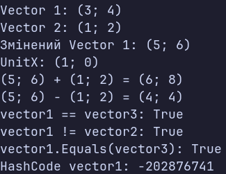

### Тема
Властивості та статичні члени. Індексатори й перевантаження операторів.

### Варіант
14. Клас `Vector2D`
- Поля: `_x`, `_y`
- Властивості: `X`, `Y`
- Статичний член: `UnitX`
- Перевантажені оператори: `+`, `-`, `==`, `!=`
- Методи: `ToString()`, `Equals()`, `GetHashCode()`

### Хід роботи
1. Створено консольний проєкт `lab4v14`.
2. Реалізовано клас `Vector2D` з приватними полями `_x` та `_y`.
3. Реалізовано публічні властивості `X` та `Y`.
4. Реалізовано статичну властивість `UnitX`, яка повертає одиничний вектор `(1; 0)`.
5. Реалізовано перевантаження операторів `+` та `-`.
6. Реалізовано оператори `==` та `!=` для порівняння векторів.
7. Перевизначено методи `ToString()`, `Equals()` та `GetHashCode()`.
8. У методі `Main()` створено три об'єкти класу та продемонстровано роботу властивостей, статичного члена, операторів і методів.

### Результат

### Висновок
У ході лабораторної роботи реалізовано клас `Vector2D` з приватними полями та публічними властивостями. Досліджено використання статичних членів класу та перевантаження операторів `+`, `-`, `==` і `!=`. Також перевизначено методи `ToString()`, `Equals()` та `GetHashCode()` для зручного представлення та порівняння об'єктів.
