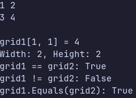

### Тема
Індексатори та перевантаження операторів.

### Варіант
14. Клас `Grid<T>`
- Поле: `_grid`
- Індексатор: `this[int x, int y]`
- Оператори: `==`, `!=`
- Властивості: `Width`, `Height`
- Метод: `Fill(T value)`
- Перевизначені методи: `ToString()`, `Equals()`, `GetHashCode()`

### Хід роботи
1. Створено консольний проєкт `lab5v14`.
2. Реалізовано узагальнений клас `Grid<T>` з двовимірним масивом `_grid`.
3. Реалізовано індексатор для читання та запису елементів сітки за координатами.
4. Реалізовано властивості `Width` та `Height` для отримання розмірів сітки.
5. Реалізовано метод `Fill()` для заповнення сітки заданим значенням.
6. Реалізовано перевантаження операторів `==` та `!=` для порівняння сіток.
7. Перевизначено методи `ToString()`, `Equals()` та `GetHashCode()`.
8. У методі `Main()` створено дві сітки та продемонстровано читання і запис через індексатор, використання `Fill()`, а також операторів `==` та `!=`.

### Результат

### Висновок
У ході лабораторної роботи реалізовано узагальнений клас `Grid<T>` з індексатором для доступу до елементів двовимірної сітки. Реалізовано властивості `Width` та `Height`, метод `Fill()` і перевантаження операторів `==` та `!=`. Також перевизначено методи `ToString()`, `Equals()` та `GetHashCode()`. Продемонстровано використання індексатора для читання та запису значень.
