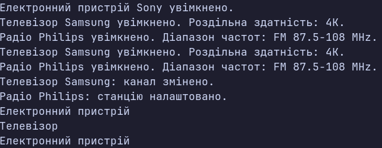

### Тема
Наслідування. Ключові слова `base`, `override`, `virtual`. Приховування членів (`new`).

### Варіант
14. Ієрархія `Electronic → Television → Radio`
- Базовий клас: `Electronic`
- Поля/властивості: `Brand`, `PowerConsumption`
- Метод: `virtual void TurnOn()`
- Похідний клас: `Television`
- Властивість: `ScreenResolution`
- Методи: `override void TurnOn()`, `void ChangeChannel()`
- Похідний клас: `Radio`
- Властивість: `FrequencyRange`
- Методи: `override void TurnOn()`, `void TuneStation()`
- Приховування методу: `new string GetElectronicType()` у `Television`
- Метод базового класу: `string GetElectronicType()`

### Хід роботи
1. Створено консольний проєкт `lab6v14`.
2. Реалізовано базовий клас `Electronic` з приватними полями та публічними властивостями `Brand` і `PowerConsumption`.
3. Реалізовано конструктор базового класу та віртуальний метод `TurnOn()`.
4. Створено похідний клас `Television`, який успадковує клас `Electronic`.
5. У класі `Television` реалізовано властивість `ScreenResolution`, метод `ChangeChannel()` та перевизначено метод `TurnOn()` за допомогою `override`.
6. Створено похідний клас `Radio`, який успадковує клас `Electronic`.
7. У класі `Radio` реалізовано властивість `FrequencyRange`, метод `TuneStation()` та перевизначено метод `TurnOn()` за допомогою `override`.
8. У конструкторах похідних класів використано `base(...)` для виклику конструктора базового класу.
9. У класі `Television` створено метод `new string GetElectronicType()`, який приховує однойменний метод базового класу `Electronic`.
10. У методі `Main()` створено об'єкти `Electronic`, `Television` та `Radio`.
11. Продемонстровано поліморфізм через виклик перевизначеного методу `TurnOn()` через посилання на базовий клас.
12. Продемонстровано різницю між `override` та `new` під час виклику методів через посилання різних типів.

### Результат

### Висновок
У ході лабораторної роботи реалізовано ієрархію класів `Electronic`, `Television` та `Radio`. Використано наслідування, конструктори `base(...)`, а також ключові слова `virtual` та `override` для реалізації поліморфізму. Продемонстровано створення власних методів похідних класів. Також реалізовано приховування методу за допомогою `new` та показано відмінність його роботи від `override` залежно від типу посилання на об'єкт.
