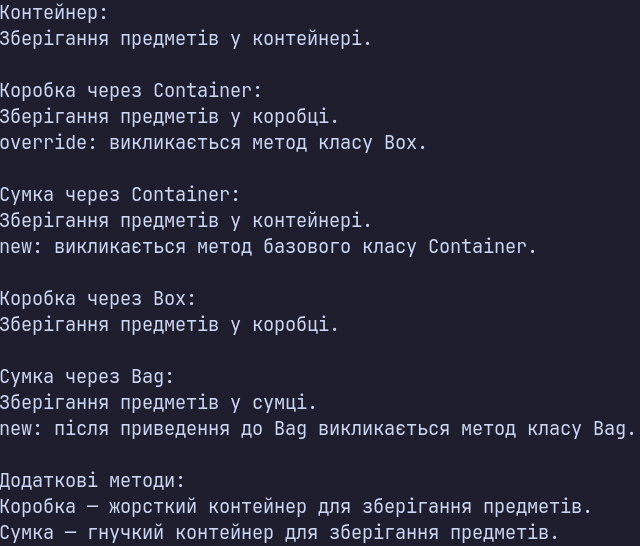

### Тема

Приховування методів (`new`) vs перевизначення (`override`).

### Варіант

14. Ієрархія `Container → Box / Bag`

* Базовий клас: `Container`
* Метод: `virtual void Store()`
* Похідний клас: `Box`
* Метод: `override void Store()`
* Похідний клас: `Bag`
* Метод: `new void Store()`

### Хід роботи

1. Створено консольний проєкт `lab7v14`.
2. Реалізовано базовий клас `Container` з віртуальним методом `Store()`.
3. Створено похідний клас `Box`, який успадковує клас `Container`.
4. У класі `Box` перевизначено метод `Store()` за допомогою ключового слова `override`.
5. Створено похідний клас `Bag`, який успадковує клас `Container`.
6. У класі `Bag` приховано метод `Store()` базового класу за допомогою ключового слова `new`.
7. У методі `Main()` створено об'єкти `Container`, `Box` та `Bag`.
8. Об'єкти `Box` та `Bag` збережено у змінних типу `Container`, що демонструє upcasting.
9. Продемонстровано поліморфізм при виклику методу `Store()` для об'єкта `Box` через посилання типу `Container`.
10. Продемонстровано різницю між `override` та `new` при виклику методу `Store()` для об'єкта `Bag` через посилання типу `Container`.
11. Виконано явне приведення типів до `Box` та `Bag` і повторно викликано метод `Store()`.
12. Результати роботи виведено в консоль із поясненням відмінностей між `override` та `new`.

### Результат

### Висновок

У ході лабораторної роботи реалізовано ієрархію `Container`, `Box` та `Bag`. Продемонстровано використання `override` для поліморфізму та `new` для приховування методу базового класу. Показано різницю між `override` та `new` під час виклику методів через посилання базового і похідного типів.
