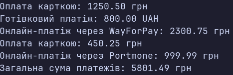

### Тема

Поліморфізм: динамічне зв’язування та перевизначення методів.

### Варіант

14. Ієрархія `Payment → CreditCardPayment / CashPayment / OnlinePayment`

**Базовий клас: `Payment`**
* Поле: `Amount`
* Метод: `virtual void Process()`

**Похідний клас: `CreditCardPayment`**
* Успадковує: `Payment`
* Поле: `CardNumber`
* Метод: `override void Process()`

**Похідний клас: `CashPayment`**
* Успадковує: `Payment`
* Поле: `Currency`
* Метод: `override void Process()`

**Похідний клас: `OnlinePayment`**
* Успадковує: `Payment`
* Поле: `Gateway`
* Метод: `override void Process()`

### Хід роботи

1. Створено консольний проєкт `lab8v14`.
2. Реалізовано базовий клас `Payment` з віртуальним методом `Process()`.
3. Створено три похідні класи та перевизначено метод `Process()`.
4. Створено колекцію `List<Payment>` з об'єктами похідних класів.
5. Виконано поліморфний виклик `Process()` для кожного об'єкта.
6. Обчислено загальну суму всіх платежів.

### Результат

### Висновок

Реалізовано поліморфну ієрархію платежів. Продемонстровано використання `virtual`, `override`, колекції базового типу та динамічного зв’язування. Обчислено загальну суму платежів.

