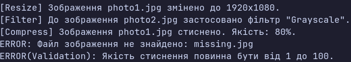

### Тема

Поліморфні сервіси: обробка зображень.

### Варіант

14. `ImageProcessor → ResizeProcessor / FilterProcessor / CompressProcessor`

**Базовий клас: `ImageProcessor`**
* Властивість: `ImagePath`
* Метод: `abstract void Process()`

**Похідні класи:**
* `ResizeProcessor` — `Width`, `Height`
* `FilterProcessor` — `FilterName`
* `CompressProcessor` — `Quality`

У кожному похідному класі реалізовано `override void Process()` та валідацію вхідних даних.

**Сервіс: `ImageProcessorService`**
* Метод: `ProcessAll(List<ImageProcessor> processors)`
* Поліморфний виклик `Process()`
* Обробка винятків

### Хід роботи

1. Створено консольний проєкт `lab9v14`.
2. Реалізовано абстрактний клас `ImageProcessor` та три похідні класи.
3. Додано валідацію та обробку помилок.
4. Створено `List<ImageProcessor>` з об'єктами різних класів.
5. Виконано поліморфний виклик `Process()`.
6. Продемонстровано помилки відсутнього файлу та некоректної якості стиснення.

### Результат

### Висновок

Реалізовано поліморфну систему обробки зображень із використанням абстрактного класу, наслідування, `override`, списку базового типу та обробки винятків.

